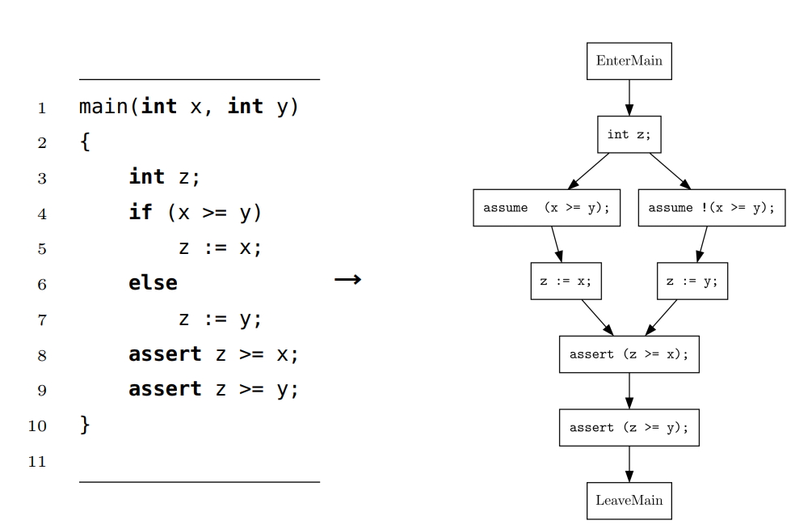

# What Is Jip?
Jip is a software testing and verification tool developed as part of a Master's thesis in the Department of Computing Sciences at Utrecht University. The goal of Jip is to discover bugs in software through symbolic execution, a method widely used in the field of software testing and verification. The tool is built with Rust and supports three different SMT-solvers as backends, namely: Z3, CVC4, and Yices2.

## Symbolic Execution with Jip
When Jip symbolically executes a program, it generates a Control Flow Graph (CFG) for it. For example, given the program in the image below on the left that assigns the maximum value to variable `z`, Jip will generate the CFG on the right. There are two possible paths through the CFG, representing all possible executions of the program. Jip will generate two formulas from the assumptions and assertions made in each path through the CFG:
1. `x >= y ==> x >= x && x >= y`
2. `!(x >= y) ==> y >= x && y >= y`

Via an SMT-solver, the tool can prove the assertions made in the program: `assert z >= x;` and `assert z >= y;` are always true, and thus, the program is correct.



## Jip Versus Other Tools
Jip was the second-best in a benchmark against eight other tools using the setup of the Competition on Software Verification (SV-COMP). In the table below, the benchmark results are shown; the **score** is a measure of how many bugs a tool could find.
    
| Tool        | Score |
|-------------|-------|
| JBMC        | 60    |
| **Jip**     | **59**|
| MLB         | 54    |
| Java Ranger | 52    |
| SPF         | 49    |
| COASTAL     | 40    |
| GDart       | 36    |
| JayHorn     | 33    |

Your readme looks well-organized and clear. I've made a few minor adjustments for clarity and formatting:

# Installation

1. [Install rustup](https://www.rust-lang.org/tools/install)
2. 
   - **Ubuntu**: `sudo apt install z3`
   - **Windows**: download [z3](https://github.com/Z3Prover/z3/releases) version 4.8.5 and make sure z3 is available as a binary on PATH
3.
   - **Ubuntu**: `sudo apt install cmake llvm clang libclang-dev`
   - **Windows**: download [cmake](https://cmake.org/download/) and [llvm](https://llvm.org/builds/)
4. Run `cargo build --release` in the root folder (it can take 20 - 30 minutes to build due to the z3 rust bindings)
5. Run with cmd `target/release/jip`
6. _Optionally:_ to use cvc4 or yices2, install verifiers and pass the argument with which they are available PATH to Jip, e.g., `target/release/jip path/to/program.oox --cvc4-arg cvc4 verify -d 100`


# Usage:

```bash
USAGE:
    jip.exe [OPTIONS] <PATH> <SUBCOMMAND>

ARGS:
    <PATH>    path to oox program

OPTIONS:
    -a, --adaptive-pruning            Turns on adaptive probabilistic pruning (prune probability will increase with successful prunes and vice versa)
    -c, --constant-pruning            Turns on constant pruning (SEE will try to prune all paths)
        --cvc4-arg <CVC4_ARG>         Passes the custom argument to call cvc4
    -e, --expression-evaluator        Turns on the expression evaluator
        --equivalent-formula-caching  Turns on formula caching
    -f, --formula-caching             Turns on formula caching
    -h, --help                        Print help information
    -i, --infer-size <INFER_SIZE>     The maximum number of iterations that the interval inference algorithm performs [default: 0]
    -p, --probabilistic-pruning       Turns on probabilistic pruning (SEE will try to prune 25% of all paths)
    -s, --symbolic-array-size <SYMBOLIC_ARRAY_SIZE>
                                      The maximum size of a symbolic array, if none is set the size is symbolic
    -V, --version                     Print version information
        --yices2-arg <YICES2_ARG>     Passes the custom argument to call yices2
        --z3-api                      Use z3's c++ api
        --z3-arg <Z3_ARG>             Passes the custom argument to call z3

SUBCOMMANDS:
    bench        Measure time to verify a program
    help         Print this message or the help of the given subcommand(s)
    print-cfg    Print cfg in Dot format
    verify       Verify program and print result
```

Verifying a program up to a depth of 100 is done with `target/release/jip path/to/program.oox verify -d 100`, or verifying a program with a timeout of 100 seconds is done with `target/release/jip path/to/program.oox verify -t 100`.


# Notes on OOX
Due to the shortcomings of Jip's parser, you must prepend fields with a hyphen:

```java
class Node {
    int value;
    Node next;
}
```
becomes
```java
class Node {
    - int value;
    - Node next;
}
```

And if you want to write an `if-then-else` statement without an else branch, you must append a semicolon:

```java
if (true){
    x := y;
} else {
    ;
}
```
becomes
```java
if (true){
    x := y;
};
```


# Testing
All tests are executed with `cargo test -r`. We have 2 types of tests:

1. **Unit tests**: constructed using the [default method](https://doc.rust-lang.org/rust-by-example/testing/unit_testing.html).
2. **Program tests**: with `build.rs` we construct one test per OOX program in the `src/tests/programs` folder. We assume a test program contains no violation of its assertions unless it has a file name ending in `_invalid`.


# Cheatsheet

- **Testing** 
   - `cargo test -r` 
   - `cargo test -- --test-threads 3`   
   - `cargo test -- --no-capture`   
- **Build** 
   - `cargo build`
   - `cargo build --release`
- **Generate docs** -> `cargo doc --open`
- **Run** -> `cargo build` and then `target/debug/jip.exe`

